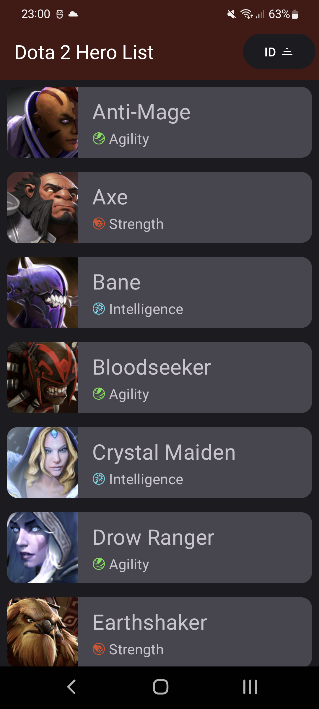
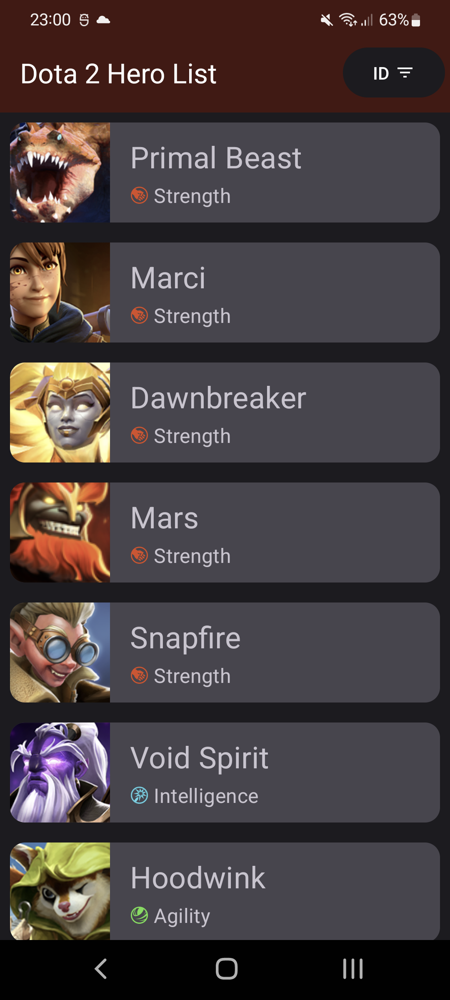
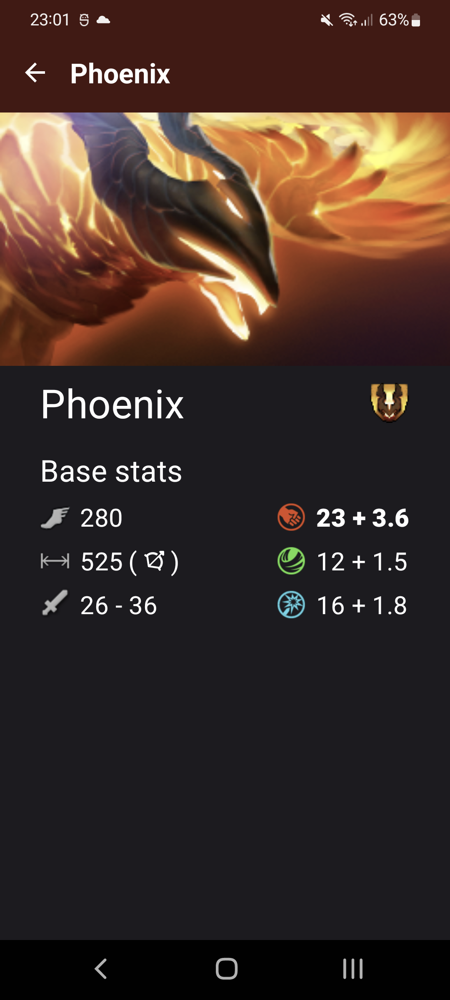

# Dota 2 Heroes

## Description
Fetching Dota 2 heroes from [Dota 2 Open Api](https://docs.opendota.com/#tag/hero-stats)

## Screenshots
|  |  |  |
|:--------------------------------:|:--------------------------------:|:--------------------------------:|

## Built With 🛠
- [Kotlin](https://kotlinlang.org/) - Official programming language for Android development.
- [Jetpack Compose](https://developer.android.com/jetpack/compose) - Android’s modern toolkit for building native UI.
- [Landscapist](https://github.com/skydoves/Landscapist) - Jetpack Compose image loading library which fetches and displays network images with Glide, Coil, and Fresco. In this project I used Glide.
- [Material Design 3](https://developer.android.com/jetpack/androidx/releases/compose-material3) - Material Design 3 for Jetpack Compose.
